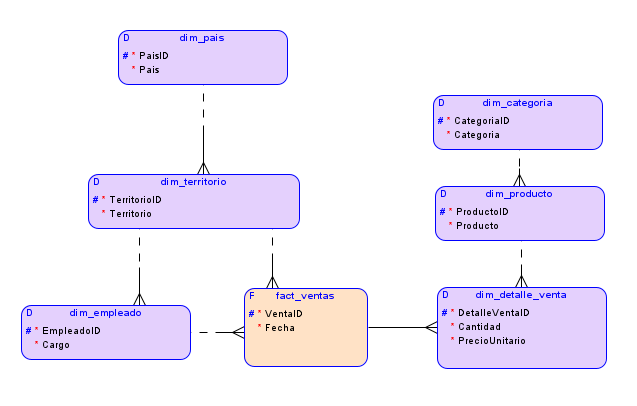
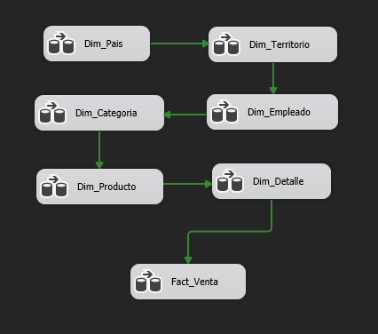
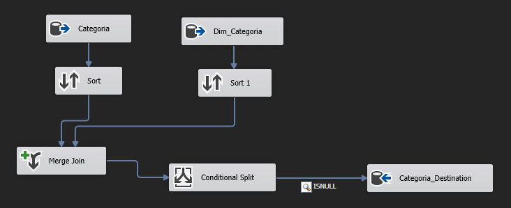
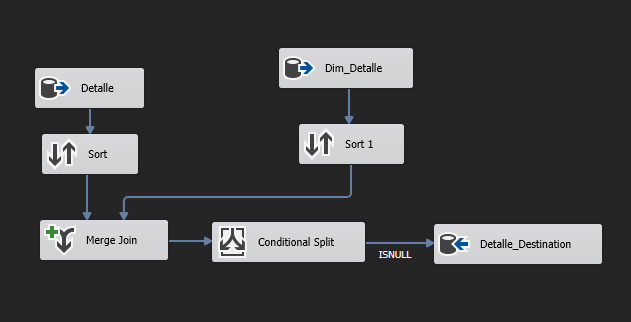
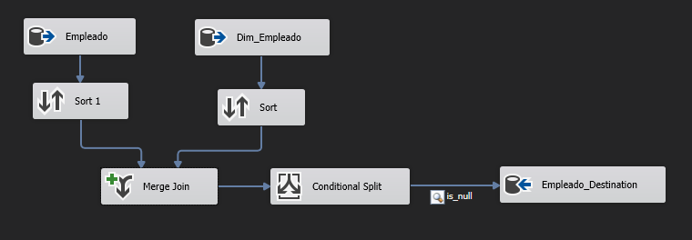
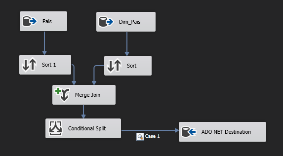
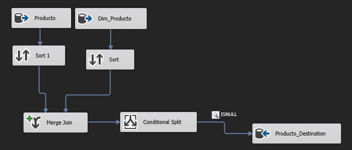
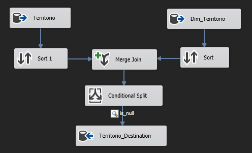
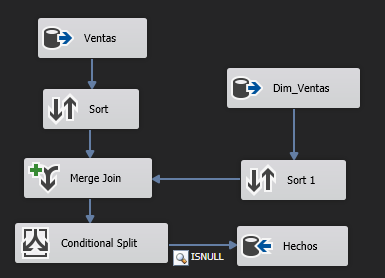

## BikeZ

### Tabla Dimensional

> loacalhost:BikeZ_DM

```sql
CREATE TABLE dim_categoria (
    categoriaid INTEGER NOT NULL,
    categoria   NVARCHAR(50) NOT NULL
);

ALTER TABLE dim_categoria ADD CONSTRAINT dim_categoria_pk PRIMARY KEY ( categoriaid );

CREATE TABLE dim_detalle_venta (
    detalleventaid          INTEGER NOT NULL,
    cantidad                SMALLINT NOT NULL,
    preciounitario          MONEY NOT NULL,
    dim_producto_productoid INTEGER,
    fact_ventas_ventaid     INTEGER NOT NULL
);

ALTER TABLE dim_detalle_venta ADD CONSTRAINT dim_detalle_venta_pk PRIMARY KEY ( detalleventaid );

CREATE TABLE dim_empleado (
    empleadoid                  INTEGER NOT NULL,
    cargo                       NVARCHAR(50) NOT NULL,
    dim_territorio_territorioid INTEGER
);

ALTER TABLE dim_empleado ADD CONSTRAINT dim_empleado_pk PRIMARY KEY ( empleadoid );

CREATE TABLE dim_pais (
    paisid NVARCHAR(3) NOT NULL,
    pais   NVARCHAR(50) NOT NULL
);

ALTER TABLE dim_pais ADD CONSTRAINT dim_pais_pk PRIMARY KEY ( paisid );

CREATE TABLE dim_producto (
    productoid                INTEGER NOT NULL,
    producto                  NVARCHAR(50) NOT NULL,
    dim_categoria_categoriaid INTEGER
);

ALTER TABLE dim_producto ADD CONSTRAINT dim_producto_pk PRIMARY KEY ( productoid );

CREATE TABLE dim_territorio (
    territorioid    INTEGER NOT NULL,
    territorio      NVARCHAR(50) NOT NULL,
    dim_pais_paisid NVARCHAR(3) 
);

ALTER TABLE dim_territorio ADD CONSTRAINT dim_territorio_pk PRIMARY KEY ( territorioid );

CREATE TABLE fact_ventas (
    ventaid                     INTEGER NOT NULL,
    fecha                       DATE NOT NULL,
    dim_territorio_territorioid INTEGER,
    dim_empleado_empleadoid     INTEGER 
);

ALTER TABLE fact_ventas ADD CONSTRAINT fact_ventas_pk PRIMARY KEY ( ventaid );

ALTER TABLE dim_producto
    ADD CONSTRAINT dim_categoria_categoriaid FOREIGN KEY ( dim_categoria_categoriaid )
        REFERENCES dim_categoria ( categoriaid );

ALTER TABLE fact_ventas
    ADD CONSTRAINT dim_empleado_empleadoid FOREIGN KEY ( dim_empleado_empleadoid )
        REFERENCES dim_empleado ( empleadoid );

ALTER TABLE dim_detalle_venta
    ADD CONSTRAINT dim_producto_productoid FOREIGN KEY ( dim_producto_productoid )
        REFERENCES dim_producto ( productoid );

ALTER TABLE dim_territorio
    ADD CONSTRAINT dim_territorio_dim_pais_fk FOREIGN KEY ( dim_pais_paisid )
        REFERENCES dim_pais ( paisid );

ALTER TABLE fact_ventas
    ADD CONSTRAINT dim_territorio_territorio_id FOREIGN KEY ( dim_territorio_territorioid )
        REFERENCES dim_territorio ( territorioid );

ALTER TABLE dim_empleado
    ADD CONSTRAINT dim_territorio_territorioid FOREIGN KEY ( dim_territorio_territorioid )
        REFERENCES dim_territorio ( territorioid );

ALTER TABLE dim_detalle_venta
    ADD CONSTRAINT fact_ventas_fk FOREIGN KEY ( fact_ventas_ventaid )
        REFERENCES fact_ventas ( ventaid );;fk FOREIGN KEY ( fact_ventas_ventaid )
        REFERENCES fact_ventas ( ventaid );
```

### Modelos




### Drop

```sql
Drop Table dim_pais;
Drop Table dim_territorio;
Drop Table dim_categoria;
Drop Table dim_producto;
Drop Table dim_detalle_venta;
Drop Table dim_empleado;
Drop Table fact_ventas;
```

### Clean

```sql
DELETE FROM dim_pais;
DELETE FROM dim_territorio;
DELETE FROM dim_categoria;
DELETE FROM dim_producto;
DELETE FROM dim_detalle_venta;
DELETE FROM dim_empleado;
DELETE FROM fact_ventas;
```

### ETL









